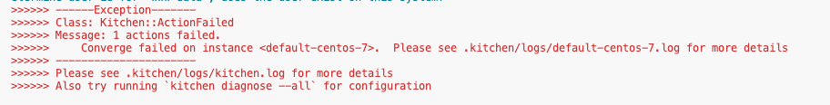
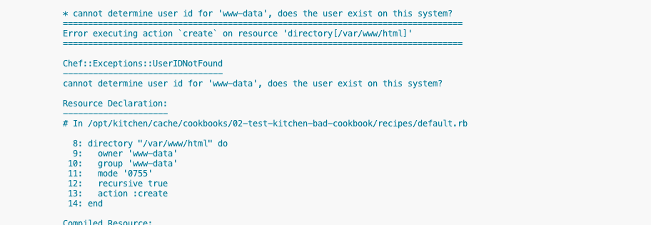
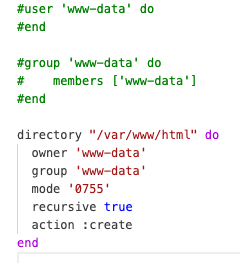

# 100 Testing With Test Kitchen

## Labs 02 - bad cookbook
This lab will provide the most basic introduction to test kitchen (w/ dokken). For additional test kitchen documentation please refer to [kitchen.ci](https://kitchen.ci/docs/)

### What you will do in this Lab
- Perform a converage with a bad cookbook
- Fix the cookbook
- Execute the InSpec verification
- Clean up

_Preperation: Open a Terminal_      
> You need to be in the /home/ec2-user/workshop/best-practices/100-testing_with_test_kitchen/labs/01-test-kitchen-introduction directory

#### Step 1: Prepare the Test Kitchen enviornments      
EXECUTE: ```./step-1.sh```      
> This will prepare Test Kitchen by downloading the required containers.

#### Step 2: Converage.      
EXECUTE: ```./step-2.sh```      
> This will execute the cookbook (that will create a directory). This will fail       
> 
> scroll up until you see the source of the error     
> 

#### Step 3: Fix the cookbook.      
> open the [recipe](./recipes/default.rb) remove the comments      
> 
EXECUTE: ```./step-3.sh```      

#### Step 4: InSpec verify.      
EXECUTE: ```./step-4.sh```      
> This will execute the InSpec test to verify the directory exists

#### Step 5: Clean up.      
EXECUTE: ```./step-5.sh```      
> This run a test kitchen destroy to cleanup the environment. 