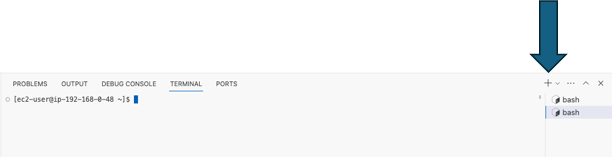

# Introduction

All of the labs are designed to be executed from a [OpenVSCode Server](https://github.com/gitpod-io/openvscode-server) running in a Progress Chef - Workshop, Demo or Immersion day environment. 

## About Open VSCode Server
This project (Open VSCode Server) provides a version of VS Code that runs a server on a remote machine and allows access through a modern web browser. It's based on the very same architecture used by Gitpod or GitHub Codespaces at scale.

### Why?
In 2019 the VS Code team started to refactor its architecture to support a browser-based working mode. As we know many of our existing users are familiar with VSCode it was decided that providing a lab (and demo) environment based upon Open VSCode Server would provide the most familar experience (to the large portion of our audience)

 
 
 
 

# Tips
If you are not familar with VS Code (or OpenVS Code Server) this section contains some common tips and actions you will need during the demo / workshop / immersion day.

 
 
 
 

## Terminal Management

### Opening a Terminal

#### Method 1
From any directory (in the explorer) you can right click and select "Open in Integrated Terminal". This will open a linux terminal (default Bash) in the given directory.

#### Method 2
Click the [hamburger icon](https://en.wikipedia.org/wiki/Hamburger_button) then select "Terminal" then "New Terminal". This will open a linux terminal in the project's "home" directory

#### Method 3
From the terminal panel (typically in the lower right) select the [downward Chevron](https://en.wikipedia.org/wiki/Chevron_(insignia)) (or  [down angle bracket](https://en.wikipedia.org/wiki/Bracket#Angle_brackets)), then select "bash".

#### Method 4
From the terminal panel (typically in the lower right) select the Plus icon to create a new terminal.

#### Method 4
If you already have two or more terminals open, you can add a new terminal (from the terminal panel) by selecting the Plus icon to create a new terminal.

### Closing a Terminal

#### Method 1
From an open terminal type "exit" then press enter. Depending on the current context of the shell you may have to do this more than on time.

#### Method 2
If you only have a single terminals open, you can close a terminal by clicking the trash can icon in from the terminal panel (typically in the lower right) 

#### Method 2
If you already have two or more terminals open, you can close a terminal by hovering over the "terminal" (often named "bash") then selecting the trash icon.

