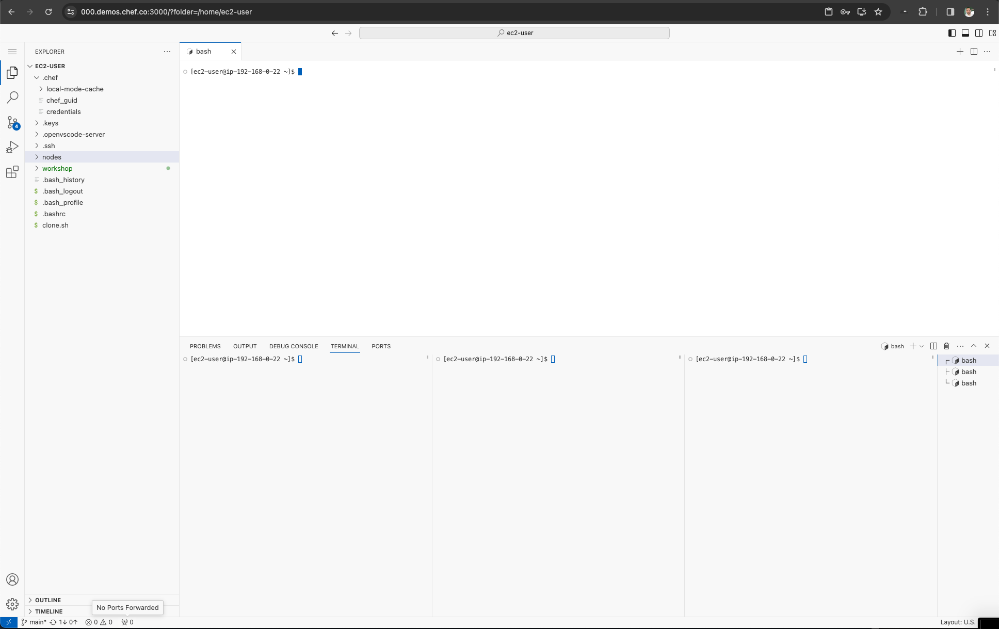

0# Setting up the Courier Lab(s)

## Labs 00 - configuration
This lab will provide the step by step instructions to prepare your VSCode workstation and Nodes for the courier workshop

### What you will do in this Lab
- Enroll Node Management on three (3) nodes
- Register three (3) nodes with the default Node Management cohort
- Have Node Management install Courier Runner & the OS interpreter 
- Layout the VSCode UI 

#### Step 1: Configure VSCode

You will need to make your VSCode screen look like the following    

> for instructions on how to configure terminals please see this [document](../../../../environment/README.md) / [video](../../../../environment/videos/vscode-server.mp4)

_after the layout has been configured_
- Rename the upper left to CLI
- Rename the upper right to Status
- Rename the bottom three panels to (node-1, node-2, node-3)

watch courier state list-job-instances


#### Step 2: Connect each node
1. In the lower left execute ```~/workshop/new-horizons/100-courier/labs/00-configuration/enroll-1.sh```
1. In the lower center execute ```~/workshop/new-horizons/100-courier/labs/00-configuration/enroll-2.sh```
1. In the lower right execute ```~/workshop/new-horizons/100-courier/labs/00-configuration/enroll-3.sh```    
> These commands will follow the journal during enrollment

1. In the uppoer right execute ```watch node node list-nodes```
> This command will poll every 2 seconds to wait for node management to have the new nodes enrolled   
> WARNING: these results are not in order and may change every few seconds

#### Step 3: Register To Node Management
In the upper left execute
1. ~/nodes/enroll.sh 
2. wait for the upper right screen to show three unique Node ID's (UUIDs)

With each UUID (from the uppor right) run the following command (in the upper left)
- ```node register <UUID>```


to ensure all nodes are registerd with skills in the upper left type
```node node list-nodes --json```

#### Step 4: Finalization
1. In the lower left press ```Control c``` to cancel the watch
1. In the lower left execute ```~/workshop/new-horizons/100-courier/labs/00-configuration/courier-1.sh```
1. In the lower center press ```Control c``` to cancel the watch
1. In the lower center execute ```~/workshop/new-horizons/100-courier/labs/00-configuration/courier-2.sh```
1. In the lower right press ```Control c``` to cancel the watch
1. In the lower right execute ```~/workshop/new-horizons/100-courier/labs/00-configuration/courier-3.sh```    
1. In the upper right hand corner press ```Control c``` to cancel the watch.
1. in the upper right type
```watch --interval 1 courier state list-job-instances```

----------------------------

#### Job 1:
in the upper left type
```courier scheduler create-job ~/workshop/new-horizons/100-courier/labs/02-when/job.json```
> It will take 2 - 3 mins for the first execution of the job to occcur

#### Job 2:
in the upper left type
```courier scheduler create-job ~/workshop/new-horizons/100-courier/labs/03-where/job.json```

#### Job 3:
in the upper left type
```courier scheduler create-job ~/workshop/new-horizons/100-courier/labs/04-what/job.json```
