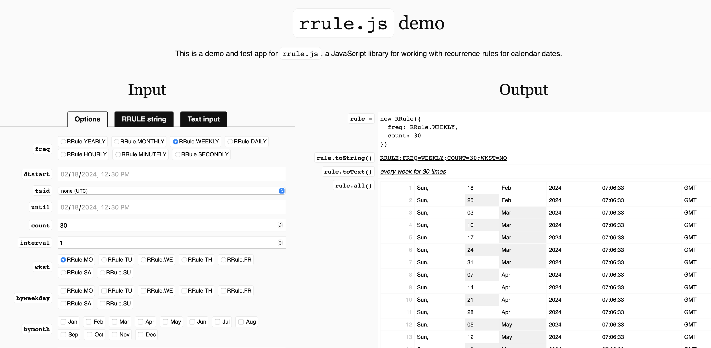

# Lab 02

## Dimension `When`


## Table of Contents
- [Example Job](#example-job)
- [Recurrence Rule](#recurrence-rule)
- [Recurrence Rule - UI](#recurrence-rule-ui)
- [Example Schedules](#example-schedules)


## Example Job

```json
{
    "name":"every_1_min_10_times",
    "description": "example RRULE",
    "scheduleRule": "RRULE:FREQ=MINUTELY;COUNT=10;INTERVAL=1",
    "target": { ... },
    "actions": {
            "accessMode": "agent",
            "steps": 
            [ ... ]
        },
    "timeoutSeconds": 300
}
```


## Recurrence Rule

The Recurrence Rule defines a rule or repeating pattern for recurring jobs.

ecurrence Rule (RRULE) is a specification that outlines how recurring events should be represented in a calendar. It’s defined in [RFC-5545](https://www.rfc-editor.org/rfc/rfc5545), also known as the iCalendar specification, which is a widely accepted standard for representing calendar data.
The RRULE specification provides a way of describing repeating events in a simple and standardized manner. With its robust set of options, you can specify events that repeat daily, weekly, monthly, or yearly, and also specify start and end dates, exceptions, and more. This format also provides a way of representing other information about an event, such as its time, location, and description.

The recurrence rule, if specified, is used in computing the recurrence set. The recurrence set is the complete set of recurrence instances for a Courer Job. 

```
recur           = recur-rule-part *( ";" recur-rule-part )
                 ;
                 ; The rule parts are not ordered in any
                 ; particular sequence.
                 ;
                 ; The FREQ rule part is REQUIRED,
                 ; but MUST NOT occur more than once.
                 ;
                 ; The UNTIL or COUNT rule parts are OPTIONAL,
                 ; but they MUST NOT occur in the same 'recur'.
                 ;
                 ; The other rule parts are OPTIONAL,
                 ; but MUST NOT occur more than once.
```
```
recur-rule-part = ( "FREQ" "=" freq )
                 / ( "UNTIL" "=" enddate )
                 / ( "COUNT" "=" 1*DIGIT )
                 / ( "INTERVAL" "=" 1*DIGIT )
                 / ( "BYSECOND" "=" byseclist )
                 / ( "BYMINUTE" "=" byminlist )
                 / ( "BYHOUR" "=" byhrlist )
                 / ( "BYDAY" "=" bywdaylist )
                 / ( "BYMONTHDAY" "=" bymodaylist )
                 / ( "BYYEARDAY" "=" byyrdaylist )
                 / ( "BYWEEKNO" "=" bywknolist )
                 / ( "BYMONTH" "=" bymolist )
                 / ( "BYSETPOS" "=" bysplist )
                 / ( "WKST" "=" weekday )
```
```
 freq           = "SECONDLY" / "MINUTELY" / "HOURLY" / "DAILY"
                / "WEEKLY" / "MONTHLY" / "YEARLY"
```
```
 weekday        = "SU" / "MO" / "TU" / "WE" / "TH" / "FR" / "SA"
 ;Corresponding to SUNDAY, MONDAY, TUESDAY, WEDNESDAY, THURSDAY,
 ;FRIDAY, and SATURDAY days of the week.
```
[^TOP^](#table-of-contents)


### Recurrence Rule UI



[RRULE Online Editor](https://jkbrzt.github.io/rrule/)

[^TOP^](#table-of-contents)


## Example Schedules

`FREQ=WEEKLY;INTERVAL=2;UNTIL=19971224T000000Z;WKST=SU;BYDAY=MO,WE,FR`

Eevery 2 weeks on Monday, Wednesday, Friday until December 24, 1997. Weeks start on Sunday.

This rule is broken down, and interpreted as follows:

- FREQ=WEEKLY — The rule applies on a weekly basis.
- INTERVAL=2 — The frequency interval is 2, making it, every 2 weeks.
- UNTIL=19971224T000000Z — The rule ends on 24 December 1997.
- WKST=SU —The rule states that Sunday is the first day of a week.
- BYDAY=MO,WE,FR — The rule applies on first Monday, Wednesday and Friday of the weeks identified by the frequency and interval.
- FREQ=WEEKLY;INTERVAL=2;COUNT=8;WKST=SU;BYDAY=TU,TH
Tuesday and Thursday, of every fortnight, for the next eight fortnights. Week starts on Sunday.

`FREQ=YEARLY;INTERVAL=4;BYMONTH=11;BYDAY=TU;BYMONTHDAY=2,3,4,5,6,7,8`

every 4 years November on Tuesday the 2nd, 3rd, 4th, 5th, 6th, 7th or 8th

`FREQ=MONTHLY;INTERVAL=2;COUNT=10;BYDAY=1SU,-1SU`

every 2 months on the 1st Sunday and last Sunday for 10 times

`FREQ=WEEKLY;INTERVAL=1;COUNT=8;BYDAY=FR`

Every Friday, for the next eight weeks.

[^TOP^](#table-of-contents)
