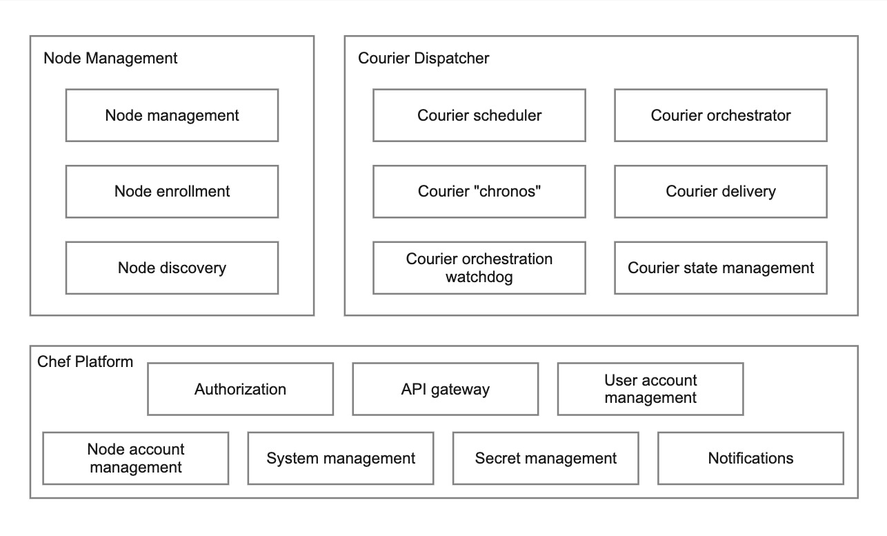
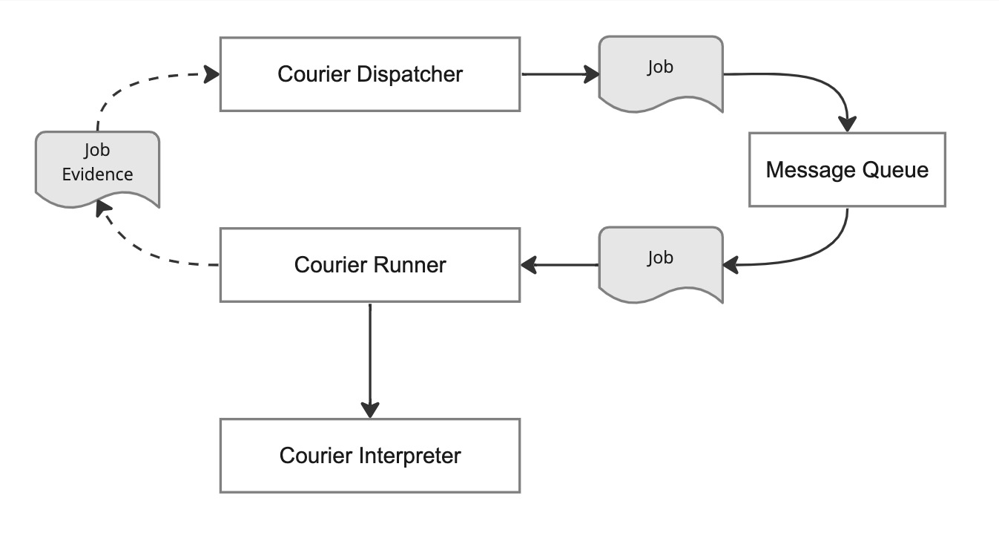

# Chef Courier
## Introduction to Chef Courier
### New Horizons - level 100
#### What and Why

---

<!-- _paginate: "false" -->
# What is Courier?

<!--
Courier is a powerful Job Orchistration component of Chef Platform. 

Job orchestration is about creating and managing workflows that automate a sequence of tasks across multiple systems. This process is crucial for managing complex IT environments, where it's necessary to synchronize and streamline operations across different platforms and tools​​.

Job orchestration streamlines and optimizes frequently occurring workflows, or enables infrequent worklows to be exeuted on-demand. It plays a crucial role in improving the efficiency of IT processes such as server provisioning, incident management, and incident response.

Courier provides the ability to rapidly integrate new tools and technologies, develop and iterate end-to-end processes, and standardize and maintain permissions, auditing, and business rules across various environments. Courier also offers a unified view for monitoring processes, infrastructure, and systems from a single location​​.
-->

---
## Purpose
Provide user the ability to execute and verify any action (_**however**_) on any set/subset of nodes (_**wherever**_), at any time interval (_**whenever**_) including immediately, subsequently, or at periodic intervals. 

<!--
Enable users to securely orchestrate and validate actions across any node or node group at desired times, including immediate execution, sequential tasks, or recurring operations, while ensuring flexibility and precision in job orchestration.

In addition Courier is intended to enable workflow and tool consolodation and demcrotization.
-->

---
<!-- _paginate: "false" -->

<!-- image source: "https://unsplash.com/photos/a-white-object-on-a-blue-background-with-a-shadow-9-dkDEXWGzI" -->

## Job Dimensions
- When
- Where
- What / How

<!-- 
When (whenever) puts you in control over the start of a workflow, this can be a one time action, a re-occuring action, or an event driven workflow. Diving deeper into the re-occuring jobs this can be as simple as every 30 mins, or more complicated such as every third thursday except on banking holidays. 

Where is about controlling what nodes and what order are included in a job. The Where dimension allows you to use static lists of servers and dynamic queries to identify where a job should run. However, the a list of nodes alone is not enough to control the blast radius, Courier lets your group those node lists/queries into distribution groups to control the order of execution and define success criteria to stop distribution before it impacts the whole fleet.

The what dimension allows you to create workflows that perform the work using whatever tools you have. Courier stands out for its ability to integrate with a wide range of automation tools (e.g., Ansible, Puppet, Chef, Jenkins, Docker, Kubernetes, and more), without requiring users to replace their existing scripts or commands. This approach acknowledges the reality of heterogeneous infrastructure and tooling within organizations, allowing Courier to serve as a unifying layer for executing workflows across various automation assets​​.
-->

---
<!-- _header: "" -->

## Courier for:
- DevOps / DevSecOps
- Platform Engineering
- Support / SRE
- Security
- Developers
- and more...

<!-- 
Job orchestration is particularly important in DevOps and DevSecOps teams, where it facilitates the coordination of tasks across development, operations, security, and QA teams. This ensures that different teams involved in the software development lifecycle are not working in silos, and it helps automate the manual steps in the deployment and management of applications​​.

Platform engineering teams benefit from job orchestration by improving resource utilization, enabling scalability and elasticity, and supporting multicloud and hybrid cloud environments. Orchestration facilitates self-service opreations, ensures high availability and fault tolerance, and optimizes costs through efficient workload allocation. It standardizes workflows, eliminating manual, ticket-driven processes, and integrates with various infrastructure resources to support diverse workloads​​.

Support teams can streamline and automate operational tasks without compromising security. Courier's centralize control over automation, allowing support teams to execute predefined jobs for common issues, thereby reducing manual effort and response times. They enhance efficiency by providing a consistent, repeatable process for resolving incidents and performing routine maintenance tasks. This leads to faster resolution of support tickets, improved system reliability, and allows support staff to focus on more strategic work instead of repetitive tasks.

Security teams can find Courier particularly beneficial for incident management, aiming to reduce the time spent on repetitive tasks and to shorten the duration of incidents with fewer escalations. It allows for the creation of workflows (referred to as "jobs") that can be triggered via the web interface, API, CLI, or on a schedule. These workflows can incorporate any existing tools or scripts, facilitating a seamless integration into current operational procedures. Chef Platform's access control features further enhance its utility by allowing the safe delegation of task execution to users who traditionally might not have access to operational tools​​.

Additionally, job orchestration is critical for cloud orchestration, container management, and security orchestration, among other areas. It allows organizations to manage complex deployments, automate container management tasks, and ensure that automated security tools work together effectively​​.
-->

---
<!-- _paginate: "false" -->

<!-- image source: "https://unsplash.com/photos/a-computer-screen-with-a-program-running-on-it-eygpU6KfOBk" -->

## User Experience
- CLI
- Open APIs
- Web UI

<!--
Chef has always been a powerful tool that integrates well within the existing workflows of customers. Courier will continue the tradition and be available through:

A Powerful CLI: For customers who have the need or preference to work on their terminal 
As APIs: Customers can access all actions of Courier through its APIs and integrate Courier into their pipelines and automation systems
An Intuitive UI Experience: A simple visual interface to create Courier templates and access reports (comming in 2024)

At launch users interact with Courier primarily through the CLI, and an extesnive API, regardless of the interace choosen, Chef Courier offers a consistent feature set across all interfaces​​.
-->

---

## Platform Components
- Node Management
- Courier
- Chef Platform

---

## Courier Components
- Courier Dispatcher
- Message Queue
- Courier Runner
- Courier Interpreter

<!-->

---
<!-- _paginate: "false" -->
<!-- _header: "" -->
<!-- _footer: "" -->

# Terminology

---

<!-- image source: "https://unsplash.com/photos/white-printer-paper-with-black-text-1UDjq8s8cy0" -->
## Courier Dispatcher

---

<!-- image source: "https://unsplash.com/photos/white-printer-paper-with-black-text-1UDjq8s8cy0" -->
## Courier Runner

---

<!-- image source: "https://unsplash.com/photos/white-printer-paper-with-black-text-1UDjq8s8cy0" -->
## Interpreter

---

<!-- image source: "https://unsplash.com/photos/white-printer-paper-with-black-text-1UDjq8s8cy0" -->
## Job

---

<!-- image source: "https://unsplash.com/photos/white-printer-paper-with-black-text-1UDjq8s8cy0" -->
## Node

---
<!-- _paginate: "false" -->
<!-- _header: "" -->
<!-- _footer: "" -->

# Scenarios

---
<!-- _paginate: "false" -->

<!-- image source: "https://unsplash.com/photos/woman-in-black-long-sleeve-shirt-covering-her-face-with-her-hands-bmJAXAz6ads" -->

# Scenario #1
It is Thursday evening now and there is a security issue (Log4j) reported. I had plans on Saturday. Now my plans are ruined because I must find servers having the issue and apply patches onto them.

---

## Without Courier

1. Has no clue how many servers are impacted
1. Non availability of out-of-the-box scans to run
1. Manual process to apply/track fix across servers in multiple environments
1. No standard reports to see effect of changes
1. Absolutely no control over timeline of events

## With Courier

1. Creates a _**Node List**_ to match servers that have Java installed
1. Creates a Courier _**Job**_ on the _**Node List**_ to do
    - Run an **InSpec** scan to detect log4j
    - Views complete report of impacted nodes
    - Understands what needs to be done based on failing controls
1. Creates another _**Job**_ to
    - Gracefully apply to 5 servers at a time
    - Apply remediation with a _**Chef Cookbook**_ 
1. Picks the _**Schedule**_ that the _**Job**_ should be executed on Friday early morning with least traffic
1. Submit the report of job execution once complete
1. Happily, keep the weekend plans

<!-- 
A job orchestration system aids in swiftly addressing vulnerabilities like Log4j by automating the detection and remediation process across impacted nodes. Initially, it identifies affected nodes through automated scanning tasks. Once identified, the system can prioritize and sequentially execute remediation scripts, ensuring that critical systems remain operational by carefully managing resource allocation and maintaining service availability. This orchestrated approach ensures a coordinated, efficient, and minimally disruptive response to such widespread vulnerabilities.
-->

---
<!-- _paginate: "false" -->

<!-- image source: "https://unsplash.com/photos/electronic-wire-lot-zFYUsLk_50Y" -->

# Scenario #2
It's that time again... time to upgrade that troublesome piece of software that requires you to maintain a quorum. This time you were voted tribute, how will you updated the system while keeping the cluster online and the quorum valid?

<!-- 
 Maintaining a quorum is crucial for many distributed systems and clustering technologies to ensure high availability and prevent split-brain scenarios, especially during updates or upgrades. Software that typically involves clustering and might require quorum maintenance includes databases (like Microsoft SQL Server with Always On availability groups), container orchestration systems (such as Kubernetes), and various distributed data stores (Splunk, HashiCorp Vault) and messaging systems (Splunk). For detailed configurations and understanding of failover cluster quorum, you might find the article https://www.starwindsoftware.com/blog/understand-failover-cluster-quorum helpful on understanding what a cluster quorum failure is
 -->

---

## Without Courier

1. 
1. 
1. 
1. 
1. 

## With Courier

1. 
1. 
    - 
    - 
    - 
1. 
    - 
    -  
1. 
1. 
1. 

<!--
A job orchestration system streamlines the process of updating or upgrading software clusters by allowing for staged updates across nodes. It manages the complexity of ensuring that only a certain number of nodes are taken offline for updates at any given time, maintaining cluster availability and load balancing. This systematic approach minimizes downtime and ensures a smooth transition during upgrades, enhancing system stability and reliability without overwhelming the operational capacity of the cluster.
-->

---
<!-- _paginate: "false" -->

<!-- image source: "https://unsplash.com/photos/man-in-blue-jacket-using-computer-aMIiBe1Lnno" -->

# Scenario #3
Your Intrusion Detection System (IDS) raises and event. A machine running may be compromised. The event needs to be validated, machine needs to be quartined, and evidence collected.

<!-- 
 -->

---

## Without Courier

1. 
1. 
1. 
1. 
1. 

## With Courier

1. 
1. 
    - 
    - 
    - 
1. 
    - 
    -  
1. 
1. 
1. 

<!--
A job orchestration system can significantly enhance the efficiency of responding to events detected by Intrusion Detection Systems (IDS) like Amazon GuardDuty. By automating responses to common or critical security alerts, the system can immediately execute predefined actions on affected nodes or across the infrastructure. This automation ensures a swift, consistent, and scalable response to potential threats, reducing the window of vulnerability and the need for manual intervention, thus maintaining system integrity and security at all times.
-->

---
<!-- _paginate: "false" -->

<!-- image source: "https://unsplash.com/photos/man-in-blue-sweater-using-silver-macbook-vIQDv6tUHYk" -->

# Scenario #4
Patching critical systems

<!-- 
 -->

---

## Without Courier

1. 
1. 
1. 
1. 
1. 

## With Courier

1. 
1. 
    - 
    - 
    - 
1. 
    - 
    -  
1. 
1. 
1. 

<!--
A job orchestration system facilitates the seamless application of software and operating system patches across a vast server fleet by scheduling and automating patch deployment. It ensures critical systems remain operational by staging the patch process, applying updates to non-critical systems first, and monitoring for failures. If a patch fails, the system can halt further deployment, preventing widespread impact. This approach allows for maintaining service availability and system integrity while ensuring the entire fleet is updated securely and efficiently.
-->

---
# Part 2: 
#### Hands-On-Labs 

