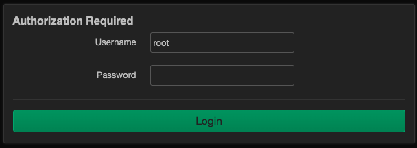
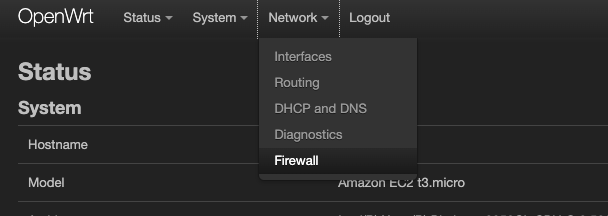
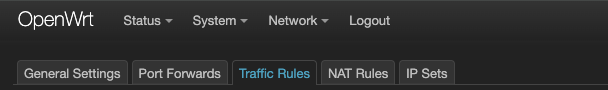

# 100 Chef Target Mode

Videos:    
- [ChefConf 2023 - Target Mode Demo](https://www.youtube.com/watch?v=qikvNBkiz_E)
- [Lab Overview](../../seminar/videos/lab-01.mp4)

## Labs 01 - OpenWRT
This lab will provide a working example of remote configuration of a network appliance using Chef Target Mode. During this workshop no agent will be installed on the network appliance, all actions will be performed from the OpenVSCode Server (the workstation) against the remote device using only SSH.

We will be using an [OpenWRT](https://openwrt.org/) VM as thet network appliance. 
> OpenWrt is a highly extensible GNU/Linux distribution for embedded devices (typically wireless routers). Unlike many other distributions for routers, OpenWrt is built from the ground up to be a full-featured, easily modifiable operating system for embedded devices. In practice, this means that you can have all the features you need with none of the bloat, powered by a modern Linux kernel.

### What you will do in this Lab
- Connect the OpenWRT Web User Interface
- Using Target Mode you will enabled a firewall rule on the OpenWRT Router
- Verify the Rule was correctly installed
- Review the Credentials File
- Review the Cookbook and Custom Resources

_Preperation: Open a Terminal_      
> You need to be in the /home/ec2-user/workshop/new-horizons/100-target-mode/labs/01-openwrt directory

_Preperation: Open OpenWRT UI_      
> the URL will change depending on the enviornment provisioned for you; however it should look like http://#####.demos.chef.co:80/ where ##### is replaced by your lab's unique DNS name (or number)

>    > WARNING: if you see the message ```{"message":"Unauthorized to access this resource"}``` your browser changed the protocol from HTTP to HTTPS. 

#### Step 1: Log in to OpenWRT UI.      
In the OpenWRT UI 
- Login with username ```root``` and password ```target-mode```    

- Navigate to ```network``` then ```firewall```    

- Click the "Traffic Rules" tab     

- Look through the rules to verify there are no "Block" rules

#### Step 2: Run the Target Mode cookbook     
EXECUTE: ```./run.sh```      
> This will prepare Test Kitchen by downloading the required containers.

#### Step 3: Log in to OpenWRT UI.      
In the OpenWRT UI 
> Note you should have been logged out    
- Login with username ```root``` and password ```target-mode```    

- Navigate to ```network``` then ```firewall```    

- Click the "Traffic Rules" tab     

- Look through the rules to verify the "Block" FTP rule is now present
