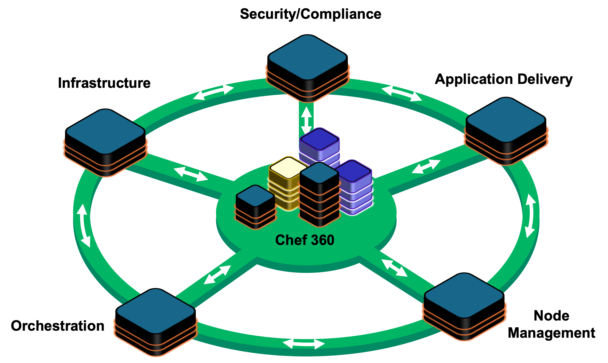
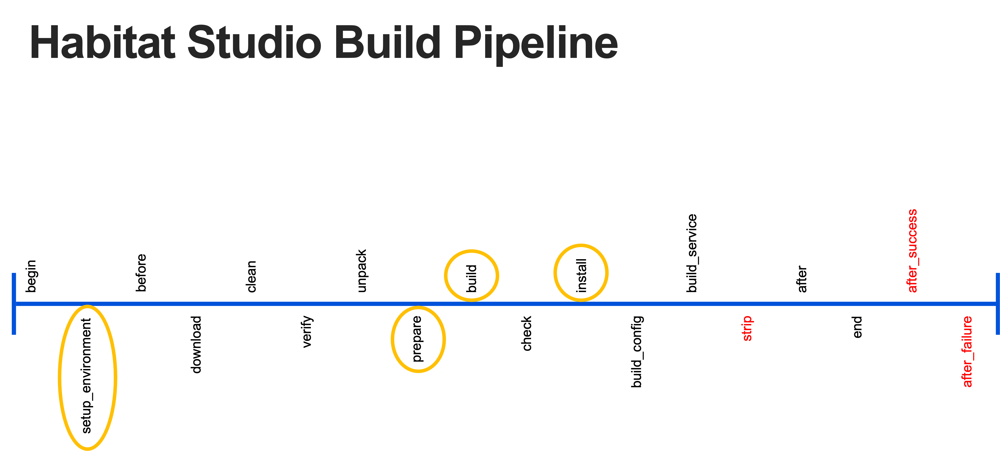
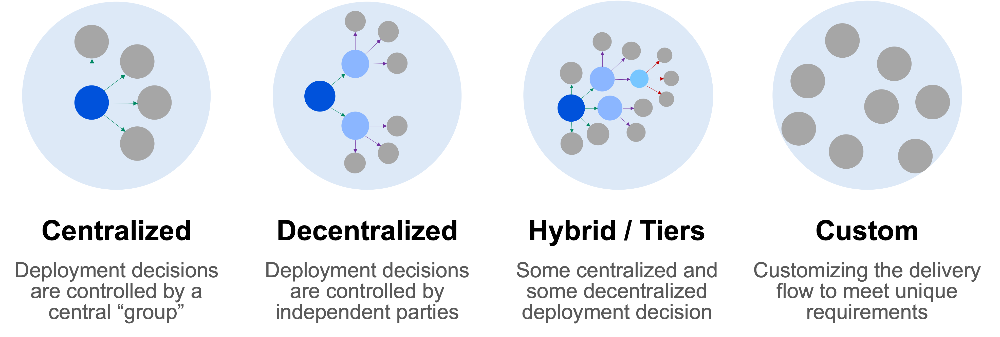
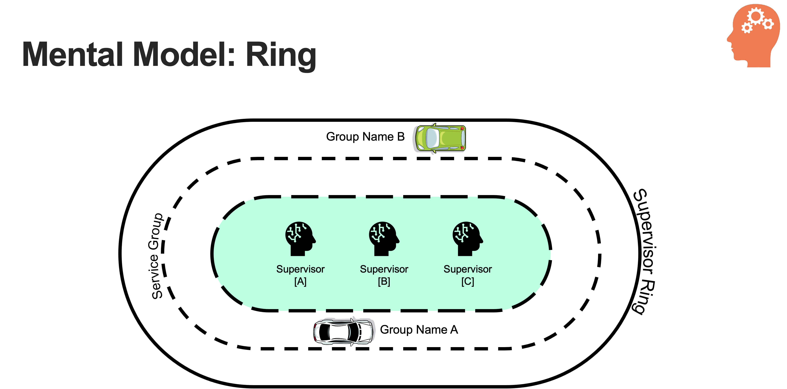

# Chef Habitat
## Introduction to Habitat
### Workshop - level 100

---

<!-- _paginate: "false" -->
<!-- image source: "https://get.pxhere.com/photo/landscape-tree-nature-forest-wilderness-plant-shore-flower-lake-river-summer-pond-pine-savanna-vegetation-wetland-reeds-habitat-ecosystem-natural-environment-woody-plant-1112797.jpg" -->
# What is Habitat?

---
<!-- _paginate: "false" -->

## Five Pillars of DevOps
- Security/Compliance
- Infrastructure 
- Node Management 
- Orchestration
- Application Delivery

---
<!-- _paginate: "false" -->

## Components 
- Package Manager
- Packaging System 
- Build System 
- Deployment System 
- Service Supervisor
- Service Clustering

---
<!-- _paginate: "false" -->

---
<!-- _paginate: "false" -->

## Package Manager

Habitat is a lightweight package manager, that uniquely allows multiple versions of a package to coexist on the same system.

---
<!-- _paginate: "false" -->

## Package System

Habitat Artifacts are immutable signed bundles that contain the build instructions, configuration instructions, and runtime settings.

---
<!-- _paginate: "false" -->

## Build System (Plan)

Plans instruct Chef Habitat on how to build, deploy, and manage your application.

Artifacts may also include application lifecycle hooks and service configuration files describing the running service’s configuration and behavior.

---
<!-- _paginate: "false" -->

---
<!-- _paginate: "false" -->
## Deployment System 

---
<!-- _paginate: "false" -->

## Service Supervisor     
     
         
The supervisor is a lightweight process manager.

- systemd
- upstart
- openrc
- sysvinit
- runit
- nssm
- srvstart

---
<!-- _paginate: "false" -->

