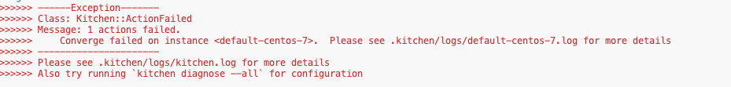
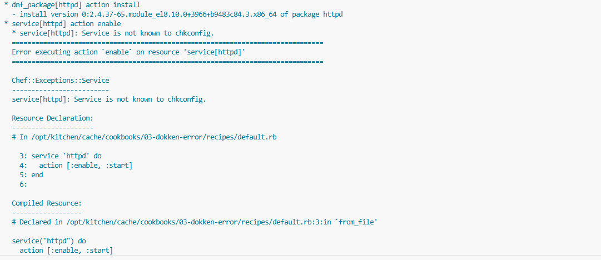
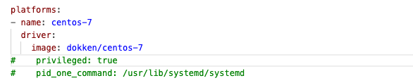

# 100 Testing With Test Kitchen

## Lab 03 - Dokken Error

This lab will provide the most basic introduction to test kitchen (w/ dokken). For additional test kitchen documentation please refer to [kitchen.ci](https://kitchen.ci/docs/)

### What you will do in this Lab

- Perform a converge with a misconfigured `kitchen.yml`.
- Fix the `kitchen.yml`.
- Destroy and create a new image.
- Execute the InSpec verification.
- Clean up.

#### Preparation: Open a Terminal

> You need to be in the `/home/ec2-user/workshop/best-practices/100-testing_with_test_kitchen/labs/01-test-kitchen-introduction` directory

#### Step 1: Prepare the Test Kitchen environments

EXECUTE: `./step-1.sh`

> This will prepare Test Kitchen by downloading the required containers.

#### Step 2: Converge

EXECUTE: `./step-2.sh`

> This will execute the cookbook. This will fail
> 
> scroll up until you see the source of the error
> 

#### Step 3: Fix the kitchen config

> open the [kitchen.yml](./kitchen.yml) remove the comments
> 
EXECUTE: `./step-3.sh`
> This still failed? why?
> This failed because changes to the kitchen.yml often require the destruction of the test environments

#### Step 4: Rebuild the environments

EXECUTE: `./step-4.sh`

> This will destroy and create the kitchen environment

#### Step 5: Converage

EXECUTE: `./step-5.sh`

> This will execute the cookbook. (it should pass this time)

#### Step 6: InSpec verify

EXECUTE: `./step-6.sh`

> This will execute the InSpec test to verify the directory exists

#### Step 7: Clean up

EXECUTE: `./step-7.sh`

> This run a test kitchen destroy to cleanup the environment.
